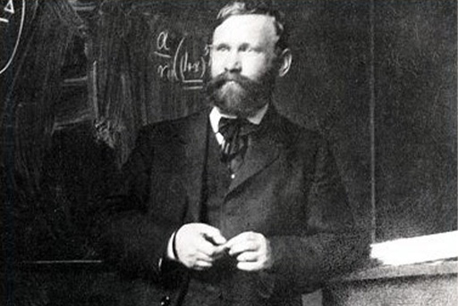

```{r setup, include=FALSE}
knitr::opts_chunk$set(echo = FALSE)
```

# **Origen**

El origen de la distribución de Erlang se encuentra atribuido al ingeniero Danés Agner Krarup Erlang, de la compañia de Telefonía de Compenhagen. Quién en 1908 buscaba saber cuantos circuitos se necesitaba para acomodar el tráfico de voz en su sistema de telefonía y a partir de allí, más adelante, en 1917, publicó "Soluciones importantes de la teoria de probabilidades aplicada a centrales automáticas de conmutación telefónica". Sus trabajos sentaron las bases para lo que hoy se conoce como la "teoría de colas". Considerado como el inventor de la ingeniería de tráfico telefónico y su unidad "Erlang" denominada en su honor. 

{width=250, height=300}

# **Características**
La distribución de Erlang es una distribución continua cuyo valor se encuentra en el dominio de los numeros reales mayores que cero.

Conformada por dos parametros:

* $\lambda$ : denomidado parametro de tasa o en ocasiones es utilizado su reciproco, $\theta$, denomidado parametro de escala.
* $k (1,2,...,n)$ :denominado parámetro de forma.

Donde el parametro de escala $\theta$ es equivalente a la media de una distribución exponencial y el parametro $k$ al número de eventos distribuidos exponencialmente, representando el numero de variables exponenciales que son sumadas para formar la variable de Erlang. 

La suma de las variables aleatorias exponenciales con el mismo factor de excala forman, por lo tanto, la variable de Erlang.

Cuando $K=1$, Erlang es similar a la distribución exponencial. A medida que $k$ va incrementando, Erlang se va aproximando a una distribución normal dado el teorema del limite central. 

Teniendo en cuenta lo anterior podemos las siguientes funciones.

* **Función de densidad de probabilidad**:

*Utilizando $\lambda$:*

$$f(x) = \frac{\lambda ^{k}x^{k-1}e^{-x}}{(k-1)!} \hspace{.5cm} \text{ para } x, \hspace{.3cm}\lambda \geq 0$$

 *Utilizando $\theta$:*
  
$$f(x)= \frac{x^{k-1}\theta^{k}}{(k-1)!e^{-\theta x}} \hspace{.5cm} \text{ para } x > 0$$

<center>


</center>
  
* **Función de probabilidad acumulada:**


$$F(x)=1-e^{{-\theta x}}\sum _{{n=0}}^{{k-1}}{\frac  {1}{n!}}(\theta x)^{n} \hspace{.5cm}\text{ para } \hspace{.3cm} x > 0$$

<center>


</center>

* **Media:**

$$\mu = \frac{k}{\theta}$$

* **Varianza:**

$$\sigma^{2} = \frac{k}{\theta^{2}}$$

* **Desviación estandar:**

$$\sigma = \frac{\sqrt{k}}{\theta}$$

* **Coeficiente de Variación:**

$$cov = \frac{\sigma}{\mu} = \frac{1}{\sqrt{k}}$$

# **Aplicaciones**

Utilizada para calcular la ocupación de recursos compartidos, como la ocupación de enlaces telefonicos, manejo y utilización de CPUS, entre otros. Esta se ha utilizado mayormente en telefonía para calcular el volumen de agentes según el tráfico. Ha sido adaptado en los Callcenters como unidad de cálculo para medir el tráfico en relación a la disponibilidade de agentes. Es decir, permite calcular el número de operadores que se necesitan para manejar todas las llamadas que entran en el sistema, volviendose un recurso de gran importancia para este campo.


# **Referencias bibliográficas**

* https://forohistorico.coit.es/index.php/personajes/personajes-internacionales/item/erlang-agner-krarup
* Nick  T.  Thomopoulos  (2017)  Statistical  Distributions:  Applications  and  Parameter Estimates, Springer International Publishing.
* https://en.wikipedia.org/wiki/Erlang_distribution
* https://omniawfm.com/blog/que-es-la-distribucion-de-erlang-call-center.php

