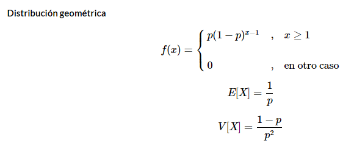
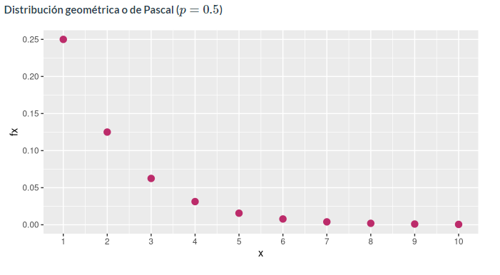
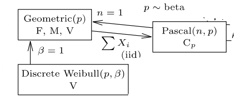

```{r setup, include=FALSE}
knitr::opts_chunk$set(echo = FALSE)
```
# Origen:
La distribución geométrica también conocida como distribución de Pascal, fue esbozada en el escrito El arte de la conjetura, escrita por Jakob Bernoulli matematico y cienfitico que nació el 27 de diciembre de 1654 en Basilea, Suiza y murio el  16 de agosto de 1705.


# Caracteristicas principales:
La distribución geométrica es un modelo adecuado para aquellos procesos en los que se repiten pruebas hasta lograr el éxito al resultado deseado.

Media: E[x]= 1/p
Varianza: Var[x]= 1-p/p^2





# Ejemplo y su solución:
La probabilidad de que cierto examen médico dé lugar a una reacción “positiva” es igual a 0,8, ¿cuál es la probabilidad de que ocurran menos de 5 reacciones negativas antes de la primera positiva? La variable aleatoria número de reacciones negativas antes de la primera positiva sigue una distribución geométrica con parámetro p = 0,8.

```{r, echo=TRUE}
dgeom(4,0.8)
E = 1.25
1/0.8    
V = 0.3125
(1-0.8)/0.8^2

```

#Relaciones entre distribuciones nivariadas



# Aplicación en diferentas campos:

En juegos de azar: La distribución geométrica permite calcular la probabilidad de que tenga que realizarse un número k de repeticiones antes de obtener un éxito por primera vez.
Se utiliza támbien en la distribución de tiempos de espera, de manera que si los ensayos se realizan a intervalos regulares de tiempo, esta variable aleatoria proporciona el tiempo transcurrido hasta el primer éxito.

# Referencias:

https://www.sergas.es/Saude-publica/Documents/1899/Ayuda_Epidat_4_Distribuciones_de_probabilidad_Octubre2014.pdf
https://www.youtube.com/watch?v=PCt4vvWnRlc&ab_channel=AulaDeEconomia
https://dgonxalex80.github.io/pye20222/recurso303.html#geom%C3%A9trico_o_de_Pascal


