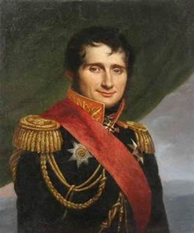
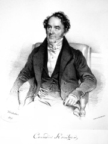
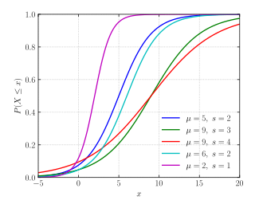
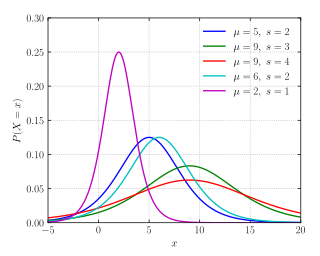
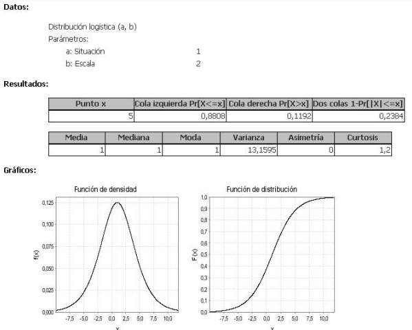

```{r setup, include=FALSE}
knitr::opts_chunk$set(echo = FALSE)
```

## Origen de la distribución logistica
La primera concepción de la logística moderna se le atribuye al barón Antoine-Henri Jomini, quien en su texto Précis de l´art de la guerre (compendio del arte de la guerra), hace referencia a una teoría de abastecimiento y distribución de tropas y estrategia de guerra.

```{r, fig.align='center'}

```

```{r, fig.align='center', out.width='50%'}

```


En 1844 el ingeniero, matemático y economista francés Jules Juvenel Dupuit definio la logística como el concepto que maneja las actividades relacionadas con el movimiento y el almacenamiento de manera coordinada, además de la percepción de la utilidad de la logística como generadora de valor agregado.

Pensamos que la denominada logística moderna tiene su origen en el ámbito de la ingeniería militar: organización del movimiento de las tropas, alojamiento, transporte y avituallamiento.

En situaciones de guerra, la eficiencia para transportar y almacenar los materiales y víveres resulta vital y la logística militar se incorpora al mundo empresarial desde donde las técnicas logísticas evolucionaron hasta su concepto actual.

Con la aparición del comercio es cuando la logística se hace imprescindible, ya que empiezan a presentarse problemas: de coordinación en la línea de producción, de abastecimiento de materias primas, de almacenamiento del producto y su distribución.

Pierre François Verhulst (1804-1849) describió por primera vez la curva logística en un trabajo, publicado en 1845, que versaba sobre las investigaciones matemáticas en las leyes que gobiernan el crecimiento de la población.

```{r, fig.align='center', out.width='50%'}

```


La distribución logística se utiliza en el estudio del crecimiento temporal de variables, en particular, demográficas.

## Características principales 
Si $X~Logistica(𝝁,S)$ entonces la variable aleatoria X satisface algunas propiedades:

### Función de distribución acomulativa
$F(x;\alpha,\beta)=\frac{1}{1+(x/\alpha)^{-\beta}}$\
  $=\frac{(x/\alpha)^{\beta }}{1+(x/\alpha)^{\beta}}$\
  $=\frac{x^{\beta }}{\alpha^{\beta }+x^{\beta}}$\
Donde $x> 0,\alpha > 0,\beta > 0$

```{r, fig.align='center', out.width='50%'}


```


### Función de densidad
$f(x;\alpha ,\beta )=\frac{(\beta /\alpha)(x/\alpha)^{\beta -1}}{(1+(x/\alpha)^{\beta})^{2}}$

```{r, fig.align='center', out.width='50%'}

```

### Media
La media de X es 𝝁, esto es:

$E[X] = 𝝁$

### Varianza
La varianza de X es $π^{2}s^{2}/3$, esto es,

$Var(X)=\frac{\pi ^{2}s^{2}}{3}$

## Ejemplo
El crecimiento relativo anual (%) de la población de un determinado país sigue una distribución logística de parámetro de posición 1 y de escala 2. Calcular la probabilidad de que el crecimiento en un año determinado sea superior al 5% y representar la función de densidad.

*Respuesta:* La probabilidad de que la población tenga un crecimiento superior al 5% es del orden de 0,12.

```{r, fig.align='center', out.width='200%'}

```

## Aplicaciones
 La distribución logística ha sido usada extensamente en áreas como:

- Biología: para describir cómo se comportan las especies en entornos competitivos.
  
- Epidemiología - para describir la propagación de epidemias.
  
- Psicología - para describir el proceso de aprendizaje.
  
- Tecnología - para describir cómo las tecnologías se popularizan y compiten entre sí.
 
- Marketing - para estudiar la difusión de nuevos productos.
  
- Energía - para estudiar la difusión y sustitución de unas fuentes de energía primarias por otras.
 
- El cálculo del elo en ajedrez utiliza actualmente la distribución logística en lugar de la normal con la que fue diseñado originalmente.
 
## Relaciones entre distribuciones nivariadas
En la teoría de la probabilidad y la estadística , existen varias relaciones entre las distribuciones de probabilidad . Estas relaciones se pueden clasificar en los siguientes grupos:

Una distribución es un caso especial de otra con un espacio de parámetros más amplio

- Transforma (función de una variable aleatoria)
- Combinaciones (función de varias variables)
- Relaciones de aproximación (límite)
- Relaciones compuestas (útil para la inferencia bayesiana)
- Dualidad 
- A priori conjugados

### Transformar de una variable
#### Múltiplo de una variable aleatoria
Al multiplicar la variable por cualquier constante real positiva se obtiene una escala de la distribución original. Algunos son autorreplicantes, lo que significa que el escalado produce la misma familia de distribuciones, aunque con un parámetro diferente: distribución normal , distribución gamma , distribución de Cauchy , distribución exponencial , distribución de Erlang , distribución de Weibull , distribución logística , distribución de error , ley de potencias. distribución , distribución de Rayleigh .

*Ejemplo:*

- Si X es una variable aleatoria gamma con parámetros de forma y velocidad $(α,β)$, entonces $Y = aX$ es una variable aleatoria gamma con parámetros $(α,β/a)$.

#### Función lineal de una variable aleatoria
La transformada afín ax + b produce una reubicación y una escala de la distribución original. Los siguientes son autorreplicantes: distribución normal , distribución de Cauchy , distribución logística , distribución de errores , distribución de potencia , distribución de Rayleigh .

*Ejemplo:*

Si Z es una variable aleatoria normal con parámetros $(μ = m, σ^2 = s^2), entonces $X = aZ + b$ es una variable aleatoria normal con parámetros $(μ = am + b, σ^2 = a^2s^2 )$.

#### Otros casos
Algunas distribuciones son invariantes bajo una transformación específica.

- Si X es un normales $(μ, sigma^2)$ variable aleatoria entonces $e^X$ es un lognormal $(μ, σ^2)$ variable aleatoria.

#### Producto de variables
El producto de las variables aleatorias independientes X e Y puede pertenecer a la misma familia de distribución que X e Y : distribución de Bernoulli y distribución logarítmica normal .

*Ejemplo:*

- Si $X_{1}$ y $X_{2}$ son variables aleatorias log-normales independientes con parámetros $(μ_{1}, σ_{2}^{1})$ y $(μ_{2}, σ_{2}^{2})$ respectivamente, entonces $X_{1}X_{2}$ es una variable aleatoria logarítmica normal con parámetros $(μ_{1}+ μ_{2}, σ_{2}^{1}+ σ_{2}^{2})$.

## Referencias bibliográficas
 - http://www.jblogistica.es/entradas/historia-de-la-logistica.html
 - https://clusterlogistic.org/es/historia-de-la-logistica/
 - https://es.wikipedia.org/wiki/Distribuci%C3%B3n_log%C3%ADstica
 - https://hmong.es/wiki/Log-logistic_distribution
 - https://hmong.es/wiki/Sum_of_independent_random_variables
 - https://www.sergas.es/Saude-publica/Documents/1899/Ayuda_Epidat_4_Distribuciones_de_probabilidad_Octubre2014.pdf