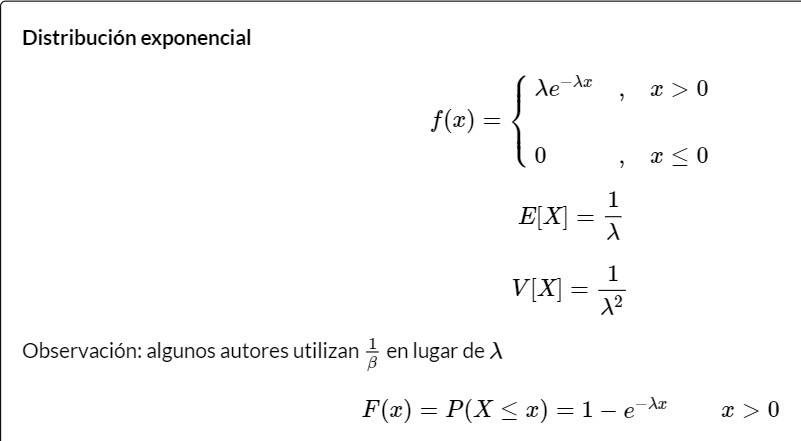
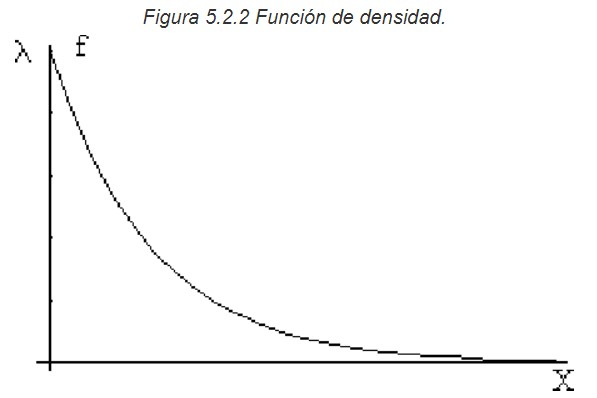
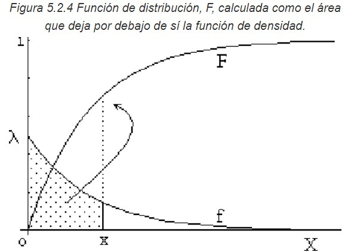
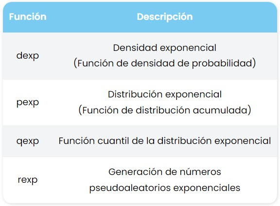
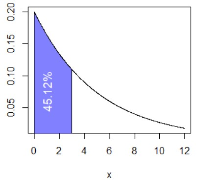
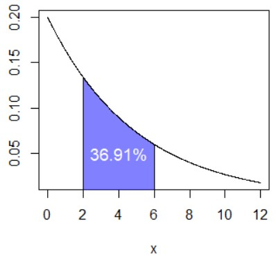
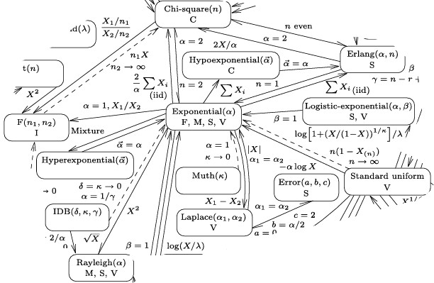

```{r setup, include=FALSE}
knitr::opts_chunk$set(echo = FALSE)
```

# Definición
La distribución exponencial es el equivalente continuo de la distribución geométrica discreta.Este modelo describe procesos en los que nos interesa saber el tiempo hasta que ocurre determinado evento sabiendo que el tiempo que puede ocurrir desde cualquier instante dado t, hasta que ello ocurra en un instante tf, no depende del tiempo transcurrido anteriormente en el que no ha pasado nada.

# ORIGEN DE LA DISTRIBUCIÓN
Gracias a Agner Krarup Erlang, un matemático danés, se identificó que la distribución exxponencial viene derivada de las distribución de Poisson ya que al suponerse que para cada valor t>0, que representa el tiempo, el número de sucesos de cierto fenómeno aleatorio sigue una distribución de Poisson de parámetro t. Por ende, los tiempos discurridos entre 2 sucesos sucesivos sigue la distribución exponencial.


# CARACTERISTICAS PRINCIPALES
Si una variable aleatoria continua X, con distribución de probabilidad exponencial tenemos que su función de densidad, su varianza, esperanza, y función de distribución son:

A su vez, su representación grafica es la siguiente:



# CODIGO EN R
Las funciones anteriormente descritas pueden calcularse con las siguientes funciones en R, sabiendo que por defecto, estas consideran la distribución exponencial con párametro λ=1. 


# Ejemplo
Se sabe que el tiempo en una página web sigue una distribución exponencial con una media de 5 minutos por visita. 
Se require calcular la probabilidad de que la visita a la pagina dure como mucho 3 minutos.

## Solución
como $E(X) = \frac {1}{\lambda}; 5 = \frac {1}{\lambda};\lambda = 0.2$.
P(X≤3)=1-[1−P(X<3)]
       =1-[1−(1−e^(−0.2*3)]
       =1-0.548812
       =0.451188

## Código en R
pexp(3, rate = 0.2) # 0.4511884 o 45.12%
1 - pexp(3, rate = 0.2, lower.tail = FALSE) # Equivalente

La probabilidad Calculada (45.12%) corresponde al área que podemos graficar en R con el siguiente código: 
exp_area(rate = 0.2, ub = 3, acolor = rgb(0, 0, 1, alpha = 0.5))
text(1, 0.075, "45.12%", srt = 90, col = "white", cex = 1.2)


## Ejemplo 1.2
Si ademas, queremos encontrar la probabilidad de que la visita dure entre 2 y 6 minutos, podemos usar la función en R:
pexp(6, rate = 0.2) - pexp(2, rate = 0.2) # 0.3691258 o 36.91%

Y si queremos obtener el grafico correspondente de la probabilidad usamos: 
exp_area(rate = 0.2, lb = 2, ub = 6, acolor = rgb(0, 0, 1, alpha = 0.5))
text(4, 0.05, "36.91%", col = "white", cex = 1.2)


# Aplicaciones
Como se habia dicho anteriormente, esta distribución se utiliza para describir procesos en los que interesa saber el tiempo hasta que ocurre determinado evento, en particular, se utiliza para modelar tiempos de supervivencia como el tiempo que tarda una parícula en desintegrarse. Se utilizan habitualmente en cálculos de fiabilidad de productos, es decir, el tiempo que dura un producto (control de calidad). 

# Relaciones entre distribuciones nivariadas
La principal reación que encontramos de la distribución exponencial es con la distribución de Poisson.


# Referencias
https://openstax.org/books/introducci%C3%B3n-estad%C3%ADstica-empresarial/pages/5-3-la-distribucion-exponencial
http://cidecame.uaeh.edu.mx/lcc/mapa/PROYECTO/libro19/52distribucin_exponencial.html
https://medium.com/qu4nt/distribucion-exponencial-python-1d921a87f835#:~:text=La%20distribuci%C3%B3n%20exponencial%20se%20encuentra,misma%20en%20la%20literatura%20estad%C3%ADstica.
https://r-coder.com/distribucion-exponencial-r/#:~:text=(2)%20%23%200.8646647-,Ejemplo%20con%20pexp%3A%20calculando%20probabilidades%20exponenciales,0.2%20%CE%BB%3D0.2.