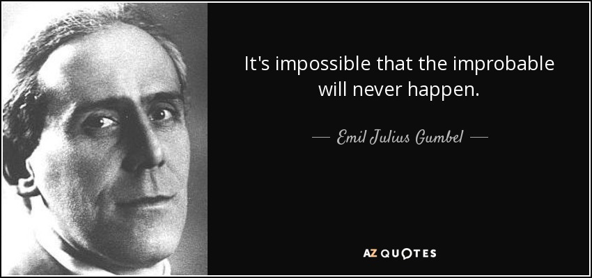

```{r setup, include=FALSE}
knitr::opts_chunk$set(echo = FALSE)
```

## **¿Quien fué E. J. Gumbel ?**

Emil Julius Gumbel (nacido el 18 de julio de 1891 en Munich; fallecido el 10 de septiembre de 1966 en Nueva York) fue matemático, activista político y pacifista. Era judío y huyó de Alemania en 1933, año en que se le privó de la nacionalidad alemana. Tuvo posteriormente las nacionalidades francesa y estadounidense. Enseñó en la Universidad de Heidelberg (Alemania), en la Sorbona y en la Universidad de Lyon (Francia), y en la New School for Social Research de Nueva York y en la Universidad de Columbia (Estados Unidos).

```{r, echo=FALSE, out.width="90%", fig.align='center'}


```


## **Contexto Modelo Gumbel**

En teoría de probabilidad y estadística la distribución de Gumbel es utilizada para modelar la distribución del máximo (o el mínimo), por lo que se usa para calcular valores extremos. Por ejemplo, sería muy útil para representar la distribución del máximo nivel de un río a partir de los datos de niveles máximos durante 10 años. Es por esto que resulta muy útil para predecir terremotos, inundaciones o cualquier otro desastre natural que pueda ocurrir.

La aplicabilidad potencial de la distribución de Gumbel para representar los máximos se debe a la teoría de valores extremos que indica que es probable que sea útil si la muestra de datos tiene una distribución normal o exponencial.

Esta distribución podría usarse para representar la distribución del nivel máximo de un río en un año en particular si hubiera una lista de valores máximos para los últimos diez años. Es útil para predecir la posibilidad de que ocurra un terremoto extremo, una inundación u otro desastre natural.

## **Origen del modelo matemático**
 
La primera distribución límite fue dada por Frechet en 1926, la segunda por Weibull a mediados de 1930 y por ultimo Gumbel en 1958, quien tuvo principal interes teorico y practico de la ultima distribucion recibiendo ası, su nombre, presentandola en el libro Statistics of extremes

## **Caracteristicas**

1. La moda es μ, mientras que la mediana es $\mu -\beta \ln \left(\ln 2\right)$, y la media viene dada por ${\displaystyle \operatorname {E} (X)=\mu +\gamma \beta }$, El apoyo por $x \in  \mathbb R$, PDF		$\frac{1}{\beta} e ^ {- (z + e ^ {- z})}$.

dónde \gamma es la constante de Euler-Mascheroni
La desviación estándar $\sigma$  es ${\displaystyle \beta \pi /{\sqrt {6}}}$ por eso ${\displaystyle \beta = \sigma {\sqrt {6}}/\pi \approx 0.78\sigma .}$ 

En el modo, donde ${\displaystyle x=\mu }$, El valor de ${\displaystyle F(x;\mu ,\beta )}$ se convierte en ${\displaystyle e^{-1}\approx 0.37}$ , independientemente del valor de ${\displaystyle \beta .}$

## **Ejemplo**

Cuando $\mu$ = 0 y $\beta$ = 1, la distribución se denomina Distribución estándar de Gumbel (mínimo). El PDF se convierte en: $\exp{(x)} \exp^{(-\exp{(x)})}$ 

## **Aplicaciones** 

1. Gumbel ha demostrado que el valor máximo (o estadístico de último orden ) en una muestra de una variable aleatoria que sigue una distribución exponencial menos el logaritmo natural del tamaño de la muestra se acerca más a la distribución de Gumbel al aumentar el tamaño de la muestra. 

2. En hidrología , por lo tanto, la distribución de Gumbel se utiliza para analizar variables tales como los valores máximos mensuales y anuales de las precipitaciones diarias y los volúmenes de descarga de los ríos, y también para describir las sequías. 

3. Gumbel también ha demostrado que el estimador $\frac{r}{\ n+1}$ para la probabilidad de un evento, donde r es el número de rango del valor observado en la serie de datos yn es el número total de observaciones, es un estimador insesgado de la probabilidad acumulada en torno a la moda de la distribución. Por lo tanto, este estimador se utiliza a menudo como posición de trazado .

4. En teoría de números , la distribución de Gumbel se aproxima al número de términos en una partición aleatoria de un entero, así como los tamaños ajustados por tendencia de los espacios primos máximos y los espacios máximos entre constelaciones primarias .

5. En el aprendizaje automático , la distribución de Gumbel a veces se emplea para generar muestras a partir de la distribución categórica. 

## Bibliografia

1. Gumbel, EJ (1935), "Les valeurs extrêmes des distributions statistiques" (PDF) , Annales de l'Institut Henri Poincaré , 5 (2): 115-158
2. Gumbel EJ (1941). "El período de retorno de los flujos de inundaciones". The Annals of Mathematical Statistics, 12, 163-190.
3. Article title:	Distribución de Gumbel DefinicionesyPropiedades
Website title:	Hmong.es
URL:	https://hmong.es/wiki/Gumbel_distribution

