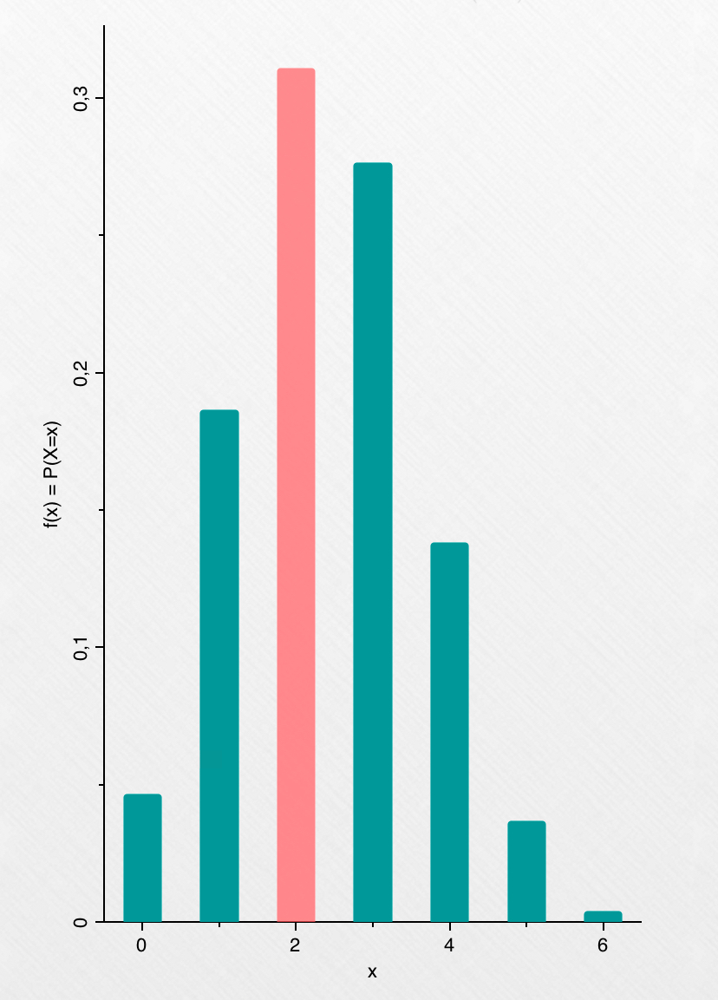
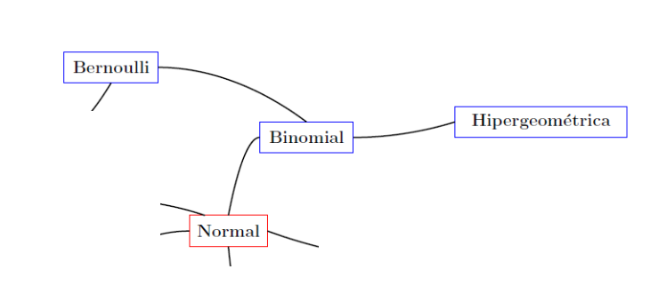

```{r setup, include=FALSE}
knitr::opts_chunk$set(echo = FALSE)
```

<p><b style = 'color : lightseagreen ; font-size: 40px;'>Un poco de historia:</b></p>

La distribución binomial fue obtenida por el suizo Jakob Bernoulli (1654-1705) y publicada en su obra póstuma "Ars Conjecttandi" (El arte de pronosticar) en 1713. La publicó su sobrino Nicholas en 1713, ocho años tras su muerte por tuberculosis.

{width="201"}

<p><b style = 'color : lightseagreen ; font-size: 40px;'>Breve definición:</b></p>

Una distribución binomial, es una distribución de probailidad discreta. Describe el número de éxitos al realizar $n$ experimentos o ensayos de Bernoulli (independientes entre sí).

<p><b style = 'color : lightseagreen ; font-size: 40px;'>Ejemplo:</b></p>

En la ciudad de Cali, afuera de la universiad Javeriana, hay 6 amigos que esperan por un taxi a las 2 de la tarde. Ellos saben que a esa hora la probabiliad de que un taxi esté libre es de 0,40. Subiendo por las Cañas Gordas se ven 6 taxis. El grupo de amigos quiere calcular la probabilidad de que 2 de esos 6 taxis estén libres.

Antes de empezar a resolver cualquier ejemplo se necesita saber si el ejercicio cumple con ser un experimento binomial, para ello, necesita tener las siguientes 4 características:

1.  El experimento consta de una secuencia de $n$ ensayos idénticos.

2.  En cada ensayo hay solo dos resultados posibles. A uno de ellos se le llama éxito y al otro, fracaso.

3.  La probabilidad de éxito no cambia de un ensayo a otro, y se denota como $p$. Mientras que la probabilidad de fracaso será $1-p$.

4.  Los ensayos son independientes, de modo que el resultado de cualquiera de ellos no influye en el resultado de cualquier otro ensayo.

En el caso de nuestro ejemplo, vamos a verificar que sí se cumplan:

1.  Un solo ensayo consiste en saber si un taxi está libre o no. El ejemplo nos habla de 6 taxis, por lo tanto se realiza $6$ veces.

2.  En nuestro ejemplo llamamos éxito al resultado de que un taxi se encuentre libre.

3.  En nuestro ejemplo la probabilidad de éxito es de 0,40, mientras que la de fracaso es de 0,60.

4.  El resultado de que un taxi esté o no libre, no va a influir en el resultado del siguiente taxi.

Ahora que se sabe que el ejemplo es un ensayo binomial, podemos utilizar la función de distribución binomial, la cual está definida como:

$$ f(x) = P(X=x) = (^{n} _{x}) (p)^x (1-p)^{n-x}  $$

Donde:

-   $n$ = Número de ensayos.
-   $x$ = Número de éxitos.
-   $p$ = Probabilidad de éxito.
-   $1-p$ = Probabilidad de fracaso.

Definimos nuestros datos:

-   $n = 6$ Número de taxis.
-   $x = 2$ Número de taxis libres.
-   $p= 0,40$ Probabilidad de que un taxi esté libre.

Reemplazamos en la función:

$$ f(2) = P(X=2) = (^{6} _{2}) (0.40)^2 (1-0.40)^{6-2} = 0.31104 $$

Esto también se puede hacer mediante R con el siguiente comando:

`dbinom(x, n, p)`

En nuestro ejemplo será:

`dbinom(2, 6, 0.40)`

```{r}
dbinom(2, 6, 0.40)
```

```{r, echo=FALSE, out.width="40%", fig.align = "center"}

```

<p><b style = 'color : lightseagreen ; font-size: 40px;'>Características principales:</b></p>

+ Valor esperado: $$  E[X] = np$$ 
+ Varianza: $$ V[X]= np(1-p)$$

<p><b style = 'color : lightseagreen ; font-size: 60px;'>Aplicaciones:</b></p>

Es utilizada frecuentemente en control de calidad, en biomédica, en estadísticas de deportes. Por ejemplo en el campo de la salud, se puede aproximar la probabilidad de que un bebe al nacer sea niño o niña.

<p><b style = 'color : lightseagreen ; font-size: 40px;'>Relaciones:</b></p>

{width="463"}

Se relaciona con las siguientes distribuciones:

-   Beta-binomial.
-   Poisson.
-   Hipergeométrica.
-   Bernoulli.
-   Polya.
-   Normal.

<p><b style = 'color : lightseagreen ; font-size: 40px;'>Referencias:</b></p>

-   <https://www.superprof.es/apuntes/escolar/matematicas/probabilidades/distribucion-binomial/>
-   <https://www.youtube.com/watch?v=-XxZGvNClkg&ab_channel=Matem%C3%B3vil>
-   <https://programas.cuaed.unam.mx/repositorio/moodle/pluginfile.php/1006/mod_resource/content/1/contenido/index.html#>:\~:text=La%20distribuci%C3%B3n%20binomial%20es%20uno,Bernoulli%2C%20matem%C3%A1tico%20y%20cient%C3%ADfico%20suizo.
-   <https://www.youtube.com/watch?v=HnSgdKvUzOU&ab_channel=Matem%C3%A1ticasenlaHistoriacon%C3%81lvaro%28Ym%C3%A1s>....%29
-   <https://github.com/dgonxalex80/probabilidad20212.io/blob/main/pdf/P-Distribuciones%20Discretas/Distribucion%20Binomial%20-%20Juan%20Jose%20Solano%20e%20Isaac%20Grun.pdf>