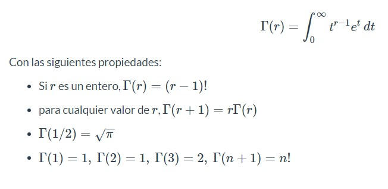
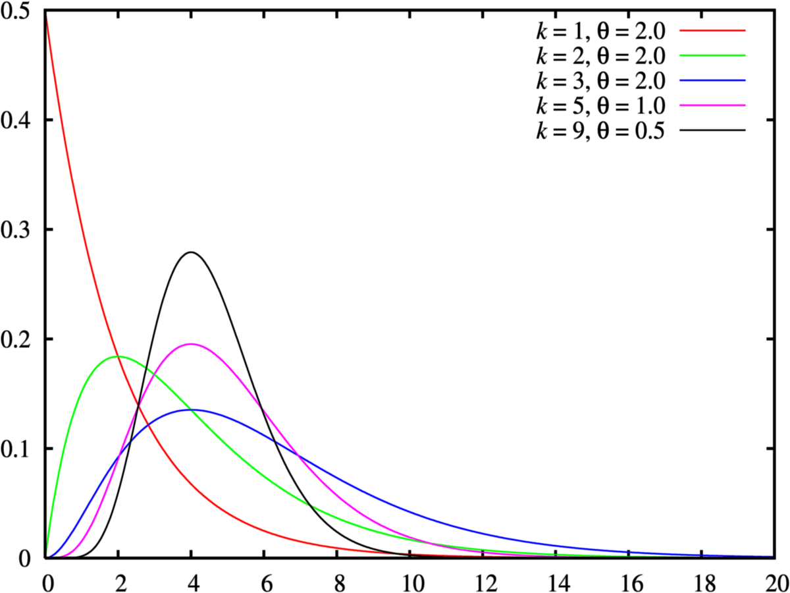
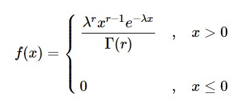
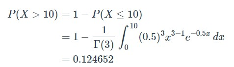

```{r setup, include=FALSE}
knitr::opts_chunk$set(echo = TRUE)
```

# Definición
Este modelo nos lleva a una función de densidad de probabilidad cuyas variables aleatorias son no negativas y tienen distribuciones sesgadas hacia la derecha, es decir la mayor parte del área bajo la curva de la función, se encuentran cerca del origen y los valores de la función de densidad disminuyen gradualmente cuando x aumenta.
Para tratar las distribuciones Gamma, es necesario definir la función Gamma como:

```{r, echo=FALSE, out.width="70%", fig.align = "center"}

```


y se ve representada graficamente así:

```{r, echo=FALSE, out.width="70%", fig.align = "center"}

```

# Origen:

La distribución Gamma tiene su origen en la familia de curvas sesgadas propuestas por Karl Pearson. Uno de los primeros y más importantes trabajos del profesor Pearson fue su contribución al análisis de curvas sesgadas. La motivación del profesor Pearson nace al notar que ciertas medidas biológicas, sociológicas y económicas, existe una desviación de la forma normal y es importante la dirección y la cantidad de esa desviación.

# Características 
La distribución Gamma se obtiene al sumar $r$ variables con distribución exponencial con parámetro $\lambda$.

Distribución

Si $Y = X_1 + X_2+....+X_r$, $X_i∼Exp(\lambda)$, entonces $Y \sim \Gamma(r,\lambda)$.

```{r, echo=FALSE, out.width="70%", fig.align = "center"}

```

Algunos autores utilizan $\frac{1}{\beta}$ en lugar de $\lambda$ y $\alpha$ en lugar de  $r$.

$$E[X]=\dfrac{r}{\lambda}$$
 
$$V[X] = \dfrac{r}{\lambda^2}$$

# Ejemplo:

En cierta ciudad el consumo diario de energía eléctrica, en millones de kilovatios por hora, puede considerarse como una variable aleatoria con distribución Gamma de parámetros $r=3$ y $\lambda = 0.5$. La planta de energía de esta ciudad tiene una capacidad diaria de 10 millones de KW/hora.

*  a) Insuficiente en un día cualquiera.
* b) Se consuman entre 3 y 8 millones de kW/hora.
* c) Obtener el consumo necesario para una probabilidad de: $P(X <x) = 0.9$.

* a) Para resolver este apartado, necesitamos resolver: $P( X > 10)$, empleamos para tal propósito, la función de distribución con el área de cola hacia la derecha y la alternativa para especificar el valor de escala:
A mano: 

```{r, echo=FALSE, out.width="70%", fig.align = "center"}

```

  
R code:

```{r}
pgamma(10,3,0.5, lower.tail = FALSE)
```


* b) Nos piden, la probabilidad: P(3 <.X <.8), empleamos para tal propósito, la función de distribución con el área de cola hacia la izquierda y la alternativa para especificar el valor de escala:
R code:

pgamma(8, 3, rate = 0.5, lower.tail = T) - pgamma(3, 3, rate = 0.5, lower.tail = T)=

```{r}
pgamma(8, 3, rate = 0.5, lower.tail = T) - pgamma(3, 3, rate = 0.5, lower.tail = T)
```


* c) En este caso nos piden obtener el consumo necesario para una probabilidad de 0.9, para tal fin, empleamos la función de quantiles indicando el área de cola hacia la izquierda:

R code:

```{r}
qgamma(0.9, 3, rate = 0.5, lower.tail = T)
```


# Aplicaciones:

La distribución gamma se aplica a una gran diversidad de áreas, permitiéndonos una metodología en el marco de análisis de la biología y la ingeniería. Es una candidata popular para modelar procesos, dada su capacidad para asumir una amplia variedad de formas.

Una elección frecuente, especialmente cuando se trata de representar datos de precipitación es la distribución gama. Muchas de estas variables atmosféricas son claramente asimétricas.
Es muy utilizada en las teorías de la fiabilidad, mantenimiento y fenómenos de espera

# Relaciones

# Referencias:

https://support.minitab.com/es-mx/minitab/21/help-and-how-to/probability-distributions-random-data-and-resampling-analyses/supporting-topics/distributions/gamma-distribution/

http://unbarquero.blogspot.com/2009/06/r-distribucion-gamma.html

https://www.coursehero.com/file/53397191/304787240-Distribucion-Gammadocx/

