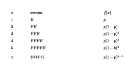

```{r setup, include=FALSE}
knitr::opts_chunk$set(echo = FALSE)
```

## Contenido del artículo

* Origen de la distribución*

* Características principales : f(x), F(x), E[X], V[X], representación gráfica*

* Ejemplo con enunciado, solución y sintaxis en R*

* Aplicaciones en el campo de las ingeniería, ciencias, economía, salud…*

* Relaciones entre distribuciones nivariadas. (Artículo)*

* Referencias bibliográficas*

## Origen de la distribución

Debido a que la distribución geométrica y de pascal presentan una relación en como funcionan, se presentan los dos autores de esta distribución. 

Fue obtenida por Jakob Bernoulli (1654-1705) y publicada en su obra póstuma Ars Conjectandi en 1713.


Jakob I fue uno de los primeros en desarrollar el cálculo más allá del estado en que lo dejaron Newton y Leibniz y en aplicarlo a nuevos problemas difíciles e importantes. Sus contribuciones a la geometría analítica, a la teoría de probabilidades y al cálculo de variaciones fueron de extraordinaria importancia.

La distribución de Pascal debe su nombre al matemático francés Blaise Pascal (1623-1662),uno de los matemáticos que creó las bases de la teoría de la probabilidad.


## Características principales : f(x), F(x), E[X], V[X], representación gráfica….

Este es un modelo discreto cuyo rango RXRX, corresponde a un conjunto de valores finito o infinitos numerables.
La distribución geométrica también conocida como distribución de Pascal, fue esbozada en el escrito El arte de la conjetura, escrita por Jakob Bernoulli. Esta distribución modela el número de ensayos Bernoulli necesarios para obtener el primer éxito. Los valores que puede tomar esta variable son:



La variable $X$ toma el valor de $1$ cuando el éxito ocurre en el primer intento. Cuando el primer éxito ocurre en el evento dos, $X$ es igual a $2$, es decir que la variable con distribución geométrica corresponde al número del evento donde ocurre el primer éxito.


*Función de probabilidad*

Si la variable aleatoria discreta X se usa para modelar el número de fracasos antes de obtener el primer éxito en una sucesión de ensayos independientes Bernoulli en donde en cada uno de ellos la probabilidad de éxito es p entonces la función de probabilidad de X- Geometrica(p) es

$$P(X = x) = p(1-p)^x \hspace{.5cm}\text{ para }  \hspace{.3cm} x = 0,1,2,3,.....$$


## Ejemplo 

Un contador publico halla que en nueve de diez auditorias empresariales se cometieron errores de importancia. Si, en consecuencia, revisa una serie de compañías, determinar las probabilidades siguientes:

A)	La primera cuenta que contiene errores serios sea la tercera contabilidad revisada.

B)	La primera cuenta con errores serios se encontrará después de revisar la tercera.


## Aplicaciones en el campo de las ingeniería, ciencias, economía, salud


La distribución geométrica se utiliza en la distribución de tiempos de espera, de manera que si los ensayos se realizan a intervalos regulares de tiempo, esta variable aleatoria proporciona el tiempo transcurrido hasta el primer éxito.

* Numero de fallos en la red*


* Numero de dispositivos defectuosos*


* Uso de la distribución geométrica como aproximación a la confiabilidad de un servicio de soporte técnico desde la perspectiva del usuario*

Se evalúa y analiza la confiabilidad de bienes intangibles mediante la aplicación al caso del servicio de soporte técnico de la Facultad de Ingeniería de la Universidad de Antioquia. Este se concibe el servicio como un sistema en serie conformado por componentes intangibles independientes entre sí, denominados dimensiones de calidad, y se emplea la distribución geométrica para modelar su comportamiento. Dicha metodología integra elementos de estadística multivariable, teoría de la probabilidad, investigación cualitativa, así como herramientas de la confiabilidad. Esta aplicación le posibilita a una organización de servicios reflexionar sobre la posición que ocupa en cuanto a confiabilidad y establecer objetivos retadores e implementar directrices de mejoramiento que permitan garantizar en el tiempo la satisfacción de las necesidades de los clientes. 


## Relaciones entre distribuciones univariadas.

Esta distribución esta relacionada con el modelo de probabilidad Bernoulli, este modelo teórico es utilizado para representar una variable aleatoria discreta la cual solo puede resultar en dos sucesos mutuamente excluyentes.


## Referencias bibliográficas

- Univariate Distribution Relationships, (Lawrence M. LEEMIS and Jacquelyn T. MCQUESTON)http://www.math.wm.edu/~leemis/2008amstat.pdf

- https://github.com/dgonxalex80/probabilidad20212.io/blob/main/pdf/P-Distribuciones%20Continuas/Modelo%20de%20probabilidad%20geometrica.pdf

- Epidat 4: Ayuda de Distribuciones de probabilidad. Octubre 2014,https://www.sergas.es/Saude-publica/Documents/1899/Ayuda_Epidat_4_Distribuciones_de_probabilidad_Octubre2014.pdf

- https://publicaciones.eafit.edu.co/index.php/revista-universidad-eafit/article/view/80

- http://www.ugr.es/~cdpye/CursoProbabilidad/pdf/P_T05_TablaGeometrica.pdf