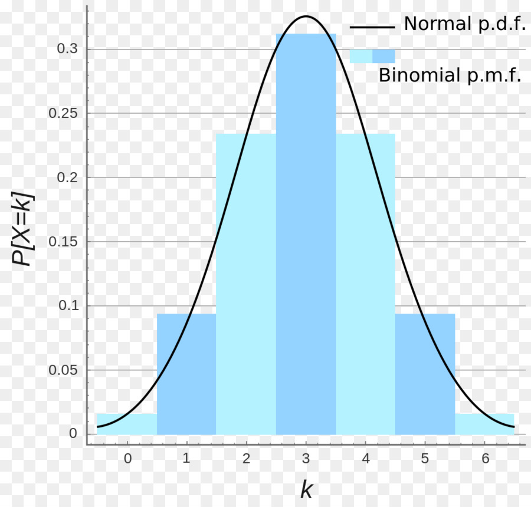

# **Origen de la distribución**

El modelo de distribución binomial fue desarrollada por Jakob Bernoulli (Suiza,1654‐1705) y "es la principal distribución de probabilidad discreta para variables dicotómicas, es decir, que sólo pueden tomar dos 2 La distribución binomial posibles resultados (...)". Sin embargo, el modelo de distribución binomial "(...) es una generalización de la distribución de Bernouilli, cuando en lugar de realizar el experimento aleatorio una sola vez , se realiza n, siendo cada ensayo independiente del anterior" (Mártinez, 2008).

# **Características Principales**

"Una distribución de probabilidad binomial es una distribución teórica, que se puede calcular mediante el uso de la fórmula de la función de probabilidad" (Mártinez, 2008). "Para construir una distribución binomial es necesario conocer el número de pruebas que se repiten y la probabilidad de que suceda un éxito en cada una de ellas" (Quevedo et al, 2014). 

Un experimento binomial tiene las siguientes características:

•	El experimento consta de **n** ensayos.

•	Cada ensayo tiene solo dos posibles resultados: éxito (E) o fracaso (F) (experimento Bernoulli).

•	La probabilidad de éxito es igual a **p** y se mantiene fija para todos los ensayos P(E). La probabilidad de fracaso es **(1−p)=q.**

•	Los ensayos son independientes.

•	La variable objeto de estudio **X**, corresponde al **número de éxitos obtenidos en los n ensayos.**

•	Se puede decir que la suma de **n** variables independientes con distribución Bernoulli(**p**), se distribuye de manera Bionomial(**n,p**)

La fórmula de la distribución binomial de probabilidad f(x) es la siguiente:

```{r, echo=FALSE, out.width="500", fig.align="center"}
# knitr::include_graphics("Image1Binom.jpg")
```

Para el caso de el valor esperado y la varianza de una distribución binomial, se calculan de la sigueinte forma:

```{r, echo=FALSE, out.width="300", fig.align="center"}
# knitr::include_graphics("Image2Binom.png")
```

"La distribución binomial se puede expresar de forma gráfica, y que en realidad consiste en un diagrama de barras, similar a los obtenidos en la función de probabilidad pero que van a ir variando su forma en función de los valores de n y de p al modificarse las probabilidades de los distintos posibles valores de P(X=x)" en este caso de P(X=k). 

```{r, echo=FALSE, out.width="300", fig.align="center"}
# 
```

# **Ejemplo de la distribución**

"Últimamente con las clases de matemática no me va muy bien, por eso, he puesto mi cafetería. Preparo unas cosas riquísimas, pasteles, pizza, agua helada, pero lo más vendido son las matehamburguesas, las únicas hamburguesas que se venden con papas y leche chocolatada. 

La probabilidad de que a un cliente nuevo le guste la matehamburguesa de Jorge es de 0,8. Si llegan 5 clientes nuevos a la cafetería, ¿cuál es la probabilidad de que solo a 3 de ellos les guste la matehamburguesa?"

**Solución:**

"En este caso, vamos a centrarnos en los clientes a los que les gusta esta hamburguesa, por ello diremos que:

X = número de clientes nuevos de 5 a los que les gusta la matehamburguesa

Entonces consideramos un éxito si al cliente le gusta esta hamburguesa. Se aplica la fórmula de distribución binomial y colocamos los valores de n, k y p. Recuerda que n es el número de ensayos, k el número de éxitos y p la probabilidad de éxito."

n = 5, x = 3, p = 0.8

En el siguiente paso se reemplazan los valores en la fórmula:

```{r, echo=FALSE, out.width="400", fig.align="center"}
# knitr::include_graphics("Image4Binom.png")
```

La respuesta es = 0,2048

**Código y solución en R**

dbinom(x=3, size=5, prob=0.8)

> dbinom(x=3, size=5, prob=0.8)
[1] 0.2048

# **Aplicaciones de la distribución Binomial**

"La distribución Binomiales sin lugar a dudas la más importante y la de mayor uso de todas las distribuciones continuas de probabilidad. Su aplicación abarca prácticamente todas las áreas de la ciencia, gran parte de los fenómenos naturales y proporciona una representación adecuada, al menos en una primera aproximación, de gran cantidad de variables físicas. Así, su uso comprende problemas relativos a la ingeniería, economía, sociología, agricultura, medicina, biología, finanzas, meteorología, geofísica, mediciones de partes manufacturadas, errores de instrumentos de medición, etc" (Mora, 2014). 

# **Relaciones entre distribuciones univariadas**

```{r, echo=FALSE, out.width="500", fig.align="center"}
# knitr::include_graphics("Image5Binom.png")
```

Fuente: Daniel Gonzales. basado en Univariate Distribution Relationships (Lawrence M. LEEMIS and Jacquelyn T.
 
En la presente imagen se pueden apreciar las relaciones de los diferentes modelos de distribución. Con rescpecto al modelo de distribución binomial se puede apreciar como se relaciona paralelamente con Bernoulli, directamente con el modleo de distribución Normal, Poisson y con el Beta Binomial, y se basan de ella los modelos de distribución Hipergeométricos, Hipergeométrico Negativo, y Polya.

# **Referencias Bibliográficas**

https://dgonxalex80.github.io/pye20222/recurso303.html

https://es.slideshare.net/EduardoGrimaldo/distribucion-binomial-35679322

https://r.search.yahoo.com/_ylt=AwrNZygN3DVj8_gJ1PtXNyoA;_ylu=Y29sbwNiZjEEcG9zAzQEdnRpZANMT0NVSTA1NENfMQRzZWMDc3I-/RV=2/RE=1664502926/RO=10/RU=https%3a%2f%2friunet.upv.es%2fbitstream%2fhandle%2f10251%2f7936%2fDistribucion%2520binomial.pdf%3fsequence%3d3/RK=2/RS=DnN.VPveXIEfxH_C9wf_Afqlez0-

https://matemovil.com/distribucion-binomial-ejercicios-resueltos/

https://es.slideshare.net/yessica-mora/distribucion-binomial-35866629