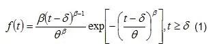
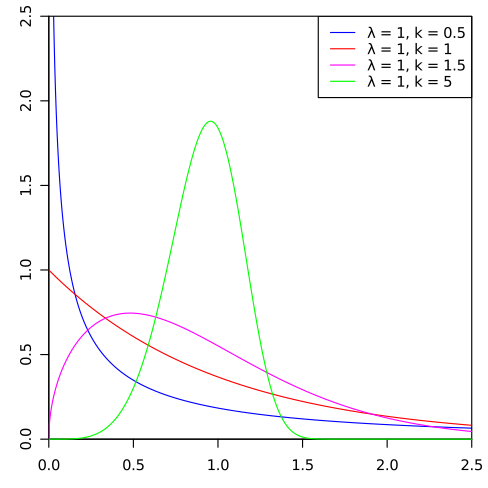
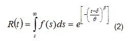
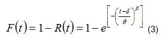
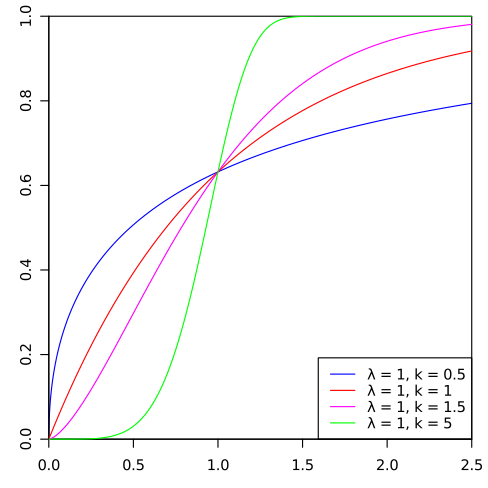
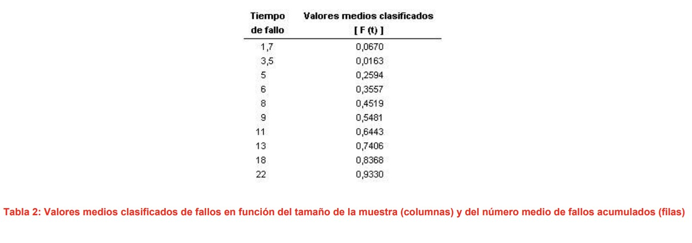
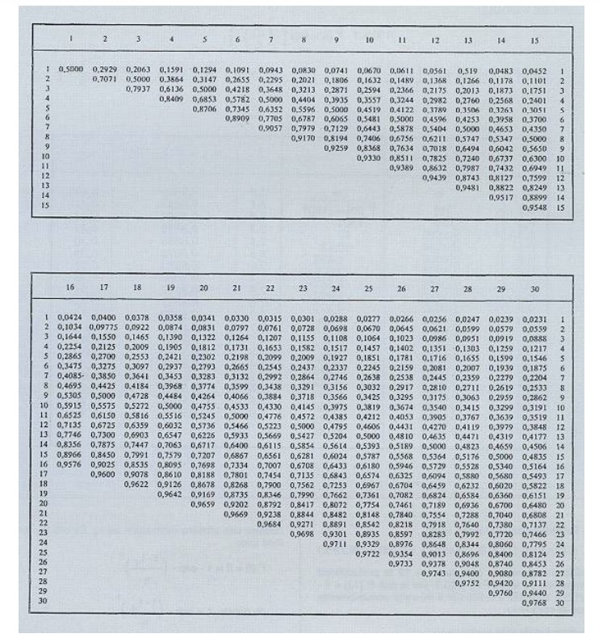
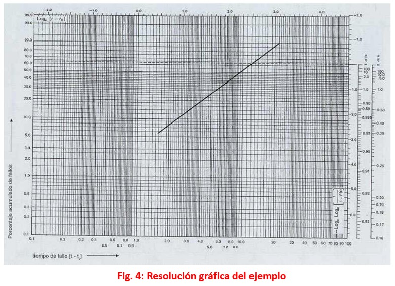

## Origen 
Su nombre proviene del ingeniero y matemático sueco Waloddi Weibull, quién describió esta distribución detalladamente por primera vez en 1951, sin embargo, su descubrimiento fue atribuído al matemático Maurice Fréchet en 1927 y fue utilizada por primera vez por Rosin y Rammler en 1933 para describir la distribución de los tamaños de determinadas partículas. (Wikipedia contributors, 2022)


## Características principales
 La distribución de Weibull es útil por su habilidad para simular un amplio rango de distribuciones por lo que es una de las distribuciones más versátiles. Es un tipo de modelo continuo que se encuentra definido por tres parámetros, en dónde el tercero suele ser un parámetro de localización de la abscisa que frecuentemente es omitido en muchos de los casos presentados. (Ingeniería De Confiabilidad Para Mantenimiento, s.f.)
 
### Expresiones matemáticas de la distribución de Weibull

- La **función de densidad f(t)** de Weibull está dada por la siguiente expresión:

```{r, echo=FALSE, out.width="45%", fig.align = 'center'}

```

t: Variable aleatoria que, para el caso de la confiabilidad, representa el tiempo entre fallas.

β: Parámetro de forma 0<β<∞ (determina la forma — o perfil— de la distribución, la cual es función del valor de éste)

θ: Parámetro de escala 0<θ<∞ (indica la escala de la distribución, es decir, muestra que tan aguda o plana es la función)

δ: Parámetro de localización -∞δ<∞ (indica, en el tiempo, el momento a partir del cual se genera la distribución.)

```{r, echo=FALSE, out.width="45%", fig.align = 'left'}

```
Tomado de: https://commons.wikimedia.org/wiki/File:Weibull_PDF.svg

- La **función confiabilidad R( t)** de Weibull se determina por la siguiente expresión:

```{r, echo=FALSE, out.width="45%", fig.align = 'center'}

```

- La **función distribución acumulativa** F( t) es el complemento de la función confiabilidad, por lo que se puede interpretar como la probabilidad de falla y se determina por la siguiente expresión:


```{r, echo=FALSE, out.width="45%", fig.align = 'center'}

```

```{r, echo=FALSE, out.width="45%", fig.align = 'left'}

```
Tomado de: https://en.wikipedia.org/wiki/File:Weibull_CDF.svg

## Ejemplo

La información disponible acerca de la duración de 10 sistemas mecánicos de detectores de presencia sometidos a funcionamiento continuo hasta que se produce un fallo, da los siguientes resultados, expresados por su duración en meses y ordenados : 1,7; 3,5 ; 5; 6; 8; 11; 13; 18 y 22.

Calcular las probabilidades acumuladas o valores medios clasificados, los parámetros de Weibull, tipo de fallo, la fiabilidad de forma general, fiabilidad para 12 meses, la duración media de vida y la desviación tipo.

**Solución**

Con la ayuda de la tabla 2, que nos da directamente los valores medios clasificados de los fallos o probabilidades acumuladas según el tamaño de la muestra que en este caso es n = 10, tendremos:

```{r, echo=FALSE, out.width="100%", fig.align = 'center'}

```

```{r, echo=FALSE, out.width="100%", fig.align = 'center'}

```

La representación de estos puntos en el gráfico de Weibull nos da prácticamente una recta (fig. 4). La pendiente de esta recta es 1,5 valor que corresponde al parámetro ß; por otro lado se puede ver gráficamente que η es igual a 12, que es el valor de la abcisa en el punto donde la recta trazada con los datos corta a la horizontal para F( t ) = 63,2.

```{r, echo=FALSE, out.width="100%", fig.align = 'center'}

```

-El valor de ß nos indica que los tipos de fallo son debidos al desgaste. La fiabilidad será: R( t ) = exp - (t / 12)1,5

-La fiabilidad para 12 meses será: R(t) = exp - (12/12)1,5 = exp - 1 = 0,3679 (36,79%)

-Gráficamente vemos que para t = 12 la probabilidad acumulada de fallos F(t) = 63,2 por lo que R(12) = 1 - F(12) = 1 - 0,632 = 0,368 (36,8 %) valor sensiblemente igual al calculado.

-La duración de vida media será : E( t ) = MTBF = η γ ( 1 + 1 / ß ) MTBF = 12 γ ( 1 + 1 / 1,5) = 12. 0,9028 = 10,83 meses

-La desviación tipo será : σ2 = η2[γ( 1 + 2 / B ) - Γ2( 1 + 1/ß )] para ß = 1,5 y según las tablas nos da el valor de σ/ η = 0,613 que como η = 12 tenemos que: σ= 12. 0,613 = 7,356 meses.

(Tamborero del Pino, s.f.)

## Aplicaciones en distintos ámbitos

-Análisis de la supervivencia

-En ingeniería, para modelar procesos estocásticos relacionados con el tiempo de fabricación y distribución de bienes

-Teoría de valores extremos

-Meteorología como el uso de la distribución de probabilidad acumulada de Weibull a lluvias diárias máximas

-Modelado de la distribución de la velocidad del viento (frecuencia con la que se dan diferentes velocidades de viento)

-En telecomunicaciones

-En sistemas de radar para simular la dispersión de la señal recibida

-En seguros, para modelar el tamaño de las pérdidas

-En la hidrología para analizar variables aleatorias como valores máximos de la precipitación ,la descarga de ríos y épocas de sequía.

(Wikipedia contributors, 2022)

## Relaciones entre distribuciones nivariadas
El modelo de distribución de Weibull se encuentra basado en el modelo de distribución exponencial, de este surgen el modelo de Rayleigh y la distribución del valor extremo. (Leemis y McQueston, 2008)

## Bibliografía

-Wikipedia contributors. (2022, September 9). Weibull distribution. In Wikipedia, The Free Encyclopedia. Retrieved 03:59, October 1, 2022, from https://en.wikipedia.org/w/index.php?title=Weibull_distribution&oldid=1109350665

-Ingeniería De Confiabilidad Para Mantenimiento.(s.f.).*Cálculo de los Parámetros de la Distribución de Weibull*. A culture of Reliability. Tomado de: https://reliabilityweb.com/sp/articles/entry/calculo-de-los-parametros-de-la-distribucion-de-weibull

-Leemis Lawrence M. & McQueston Jacquelyn T. (2008) Univariate Distribution Relationships. The American Statistician. 62:1, 45-53. Tomado de: https://www.stat.rice.edu/~dobelman/courses/texts/leemis.distributions.2008amstat.pdf

-Tamborero del Pino José María.(s.f.) NPT 331: Fiabilidad: La distribución de Weibull. CENTRO NACIONAL DE CONDICIONES DE TRABAJO Tomado de: http://cso.hermes-soft.com/legislacion/notas_tecnicas_preventivas_insht/NTP%20331%20-%20Fiabilidad%20la%20distribucion%20de%20Weibull.pdf